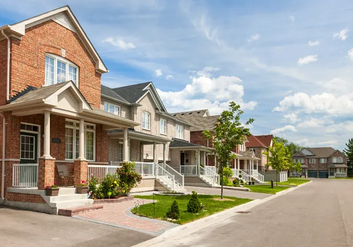

## Projeto Panfleto


# Projeto Panfleto


## Índice
- [Descrição](#descrição)
- [Tecnologias Utilizadas](#tecnologias-utilizadas)
- [Funcionalidades](#funcionalidades)
- [Como Usar](#como-usar)
- [Exemplo de Uso](#exemplo-de-uso)
- [Contribuição](#contribuição)
- [Licença](#licença)

- ## Descrição

🎉 Esta página foi desenvolvida como uma idéia de transformar coisas do dia a dia em sites intuitivos e 
bonitos. Foi um projeto baseado em um panfleto encontrado nos correios e, claro, que todos os dados foram
alterados, pois este é um projeto ilustrativo, sem qualquer ligação com qualquer planejamento de condomínio.
As fotos, frases e tudo na página, foi editada ou criada do 0, pegando apenas o modelo do panfleto.
Esse é um condomíneo fictício.

## Tecnologias Utilizadas
- **HTML5**: Estrutura da página.
- **CSS**: Estilo e layout e Responsividade.
- **JavaScript**: Interação de modals

## Funcionalidades
- 📸 Exibição de como seria esse panfleto em forma de página.
- 🔗 Links para redes sociais (WhatsApp, LinkedIn e GitHub).

## Como Usar
1. **Clone o repositório**:
   ```bash
   git clone https://github.com/joaobosco25/Panfleto.git

## Contribuição
🤝 Contribuições são bem-vindas! Sinta-se à vontade para abrir um *pull request* ou relatar problemas.

## Licença
📜 Este projeto está licenciado sob a MIT License. Veja o arquivo `LICENSE` para mais detalhes.

## Tecnologias Utilizadas

| Tecnologia        | Descrição                          |
|-------------------|------------------------------------|
| **HTML5**         | Estrutura da página.               |
| **CSS3**          | Estilo e layout.                   |
| **JavaScript**    | Funcionalidade interativa          |
| **Google Fonts**  | Tipografia.                        |
| **Ion Icons**     | Ícones.                            |


## Estrutura de Diretórios
PANFLETO/
├── assets/
│   ├── depositphotos_39363733-stock-photo-suburban-homes.jpg
│   ├── images.jpg
├── index.html
├── script.js
└── style.css


## Funcionalidades

- Exibição de uma página baseada em um panfleto, para fins educacionais.